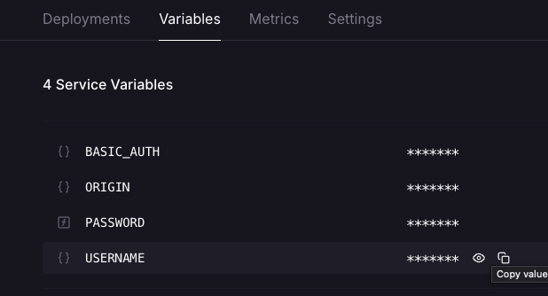
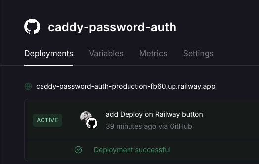
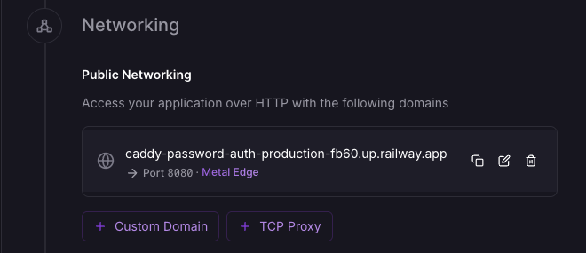

# BentoPDF + Caddy (Protected)

A complete solution for deploying BentoPDF with password protection using Caddy as an authentication gateway.

[](https://railway.com/deploy/bentopdf-auth?referralCode=CG2P3Y&utm_medium=integration&utm_source=template&utm_campaign=generic)

## Overview

This solution combines:
- **BentoPDF**: Client-side PDF toolkit (merge, split, watermark, convert)
- **Caddy Password Auth**: Lightweight reverse proxy with basic authentication

BentoPDF runs on Railway's private network, accessible only through the Caddy gateway which handles authentication.

## Architecture

```
┌─────────────┐     ┌─────────────────┐     ┌─────────────┐
│   Internet  │────>│  Caddy (auth)   │────>│  BentoPDF   │
│             │     │  (public)       │     │  (internal) │
└─────────────┘     └─────────────────┘     └─────────────┘
                         PORT: 80              PORT: 8080

                    USERNAME=admin
                    PASSWORD=<auto-generated>
```

## Quick Start

1. Click the **Deploy on Railway** button above
2. (Optional) Change `USERNAME` and `PASSWORD` - secure defaults are pre-configured
3. Deploy and access via the generated Railway domain

## Environment Variables

### Caddy Service

#### User-Configurable Variables

| Variable | Default | Description |
|----------|---------|-------------|
| `USERNAME` | `admin` | Login username to access BentoPDF |
| `PASSWORD` | Auto-generated (32 chars) | Login password. A secure random password is generated on deploy. |

#### Auto-Configured (Do Not Change)

| Variable | Description |
|----------|-------------|
| `BASIC_AUTH` | Generated from `USERNAME:PASSWORD`. Used internally by Caddy. |
| `ORIGIN` | Routes traffic to BentoPDF via Railway's private network. Changing this will break the connection. |

### BentoPDF Service

No configuration required. The service runs on port 8080 internally and is pre-configured.

## Finding Your Login Credentials

To find your username and password:

1. Open your Railway project dashboard
2. Click on the **Caddy** service
3. Go to the **Variables** tab
4. Find `USERNAME` and `PASSWORD` - click the eye icon to reveal or use "Copy value"



## Finding Your Public URL

After deployment, click on the **Caddy** service (not BentoPDF) and use one of these methods:

### Method 1: Deployments Tab

The URL is displayed directly under the service name on the Deployments tab.



### Method 2: Settings > Networking

Go to **Settings** tab → scroll to **Networking** → find **Public Networking**.



**Note**: Only the Caddy service has a public URL. BentoPDF is internal-only and accessed through Caddy.

## Services Included

| Service | Source | Role |
|---------|--------|------|
| BentoPDF | `bentopdf/bentopdf:latest` | PDF processing (internal) |
| Caddy | [iliab1/caddy-password-auth](https://github.com/iliab1/caddy-password-auth) | Auth gateway (public) |

## Security

- BentoPDF is not exposed to the internet
- All traffic routes through Caddy with basic authentication
- Railway's private networking ensures service isolation
- All PDF processing happens client-side (no server uploads)
